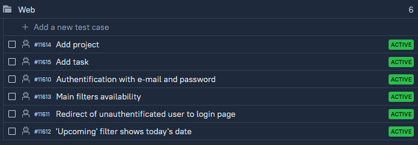
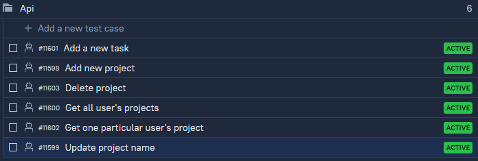
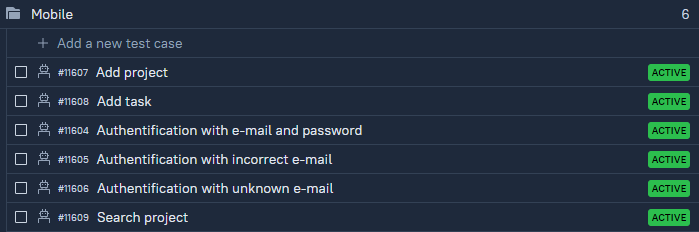
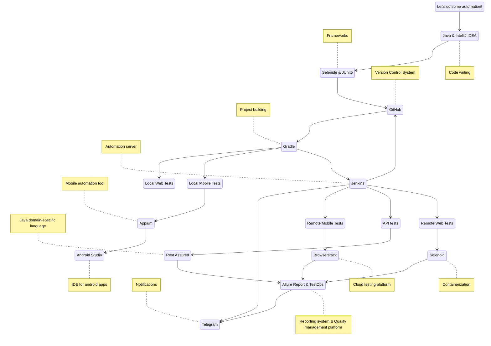
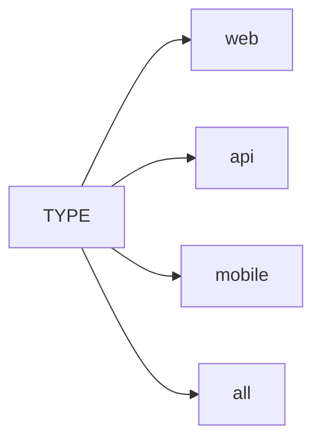
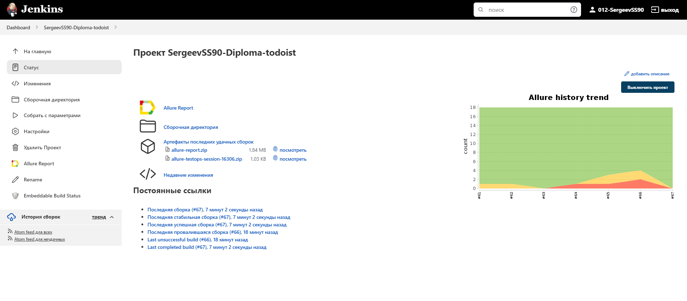
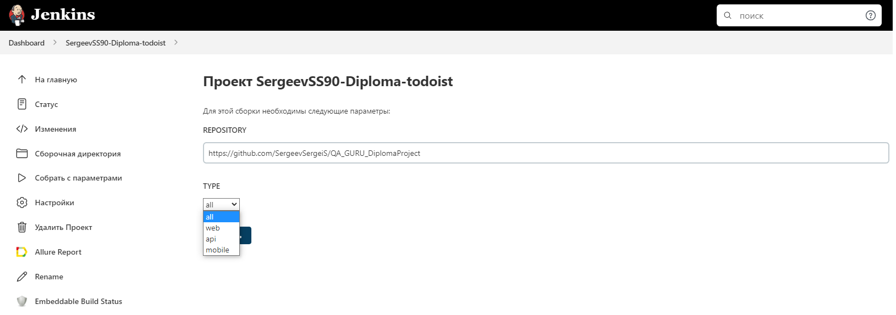

# Automated web/mobile/api tests for the [Todoist](http://todoist.com/) task manager  - graduation project ([QA.GURU](https://qa.guru/) school)
<p align="left">

</p>

##  :page_with_curl: Content

➠ [Test cases](#TestCases)

➠ [Technology stack](#TechnologyStack)

➠ [Launch from the terminal](#Terminal)

➠ [Jenkins job](#Jenkins)

## :globe_with_meridians: <a name="TestCases"></a> Test cases
- ### WEB
<p align="left">

</p>

- ### API
<p align="left">

</p>

- ### MOBILE
<p align="left">

</p>

## :computer: <a name="TechnologyStack"></a> Technology stack

<p align="center">


</p>



## :technologist: <a name="Terminal"></a> Launch from the terminal

### Local test run:

```
gradle clean mobileTests -DmobileDeviceHost=emulation
```

### Remote test run:

```
gradle clean 
${TYPE}Tests
```



## <a name="Jenkins"></a> Jenkins [job](https://jenkins.autotests.cloud/job/SergeevSS90-Diploma-todoist/)

<p align="center">
  
</p>

### :robot: Build Options

<p align="center">
  
</p>
